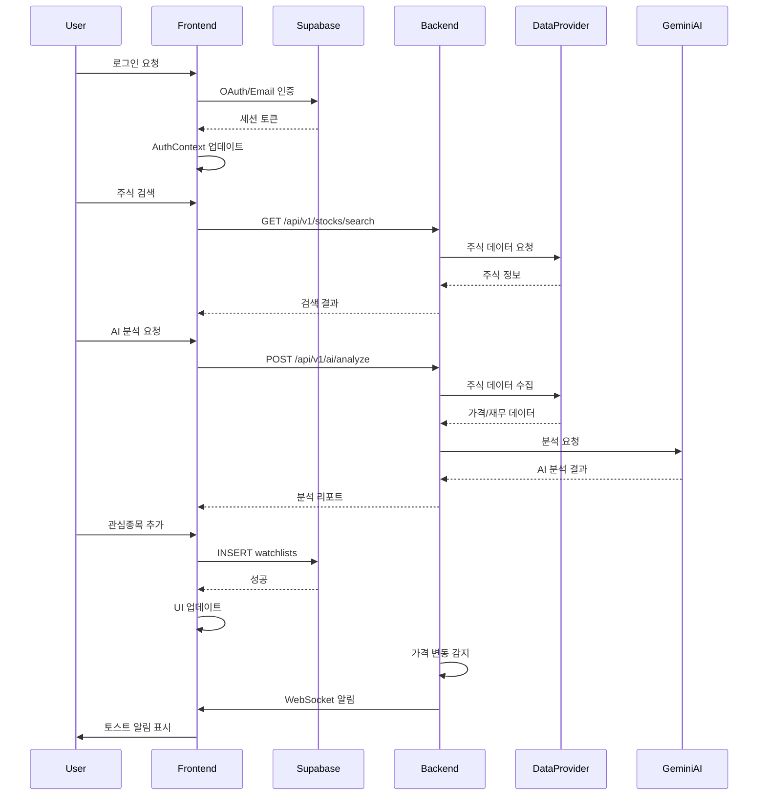
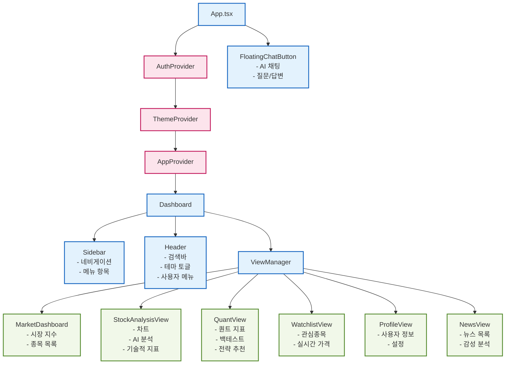
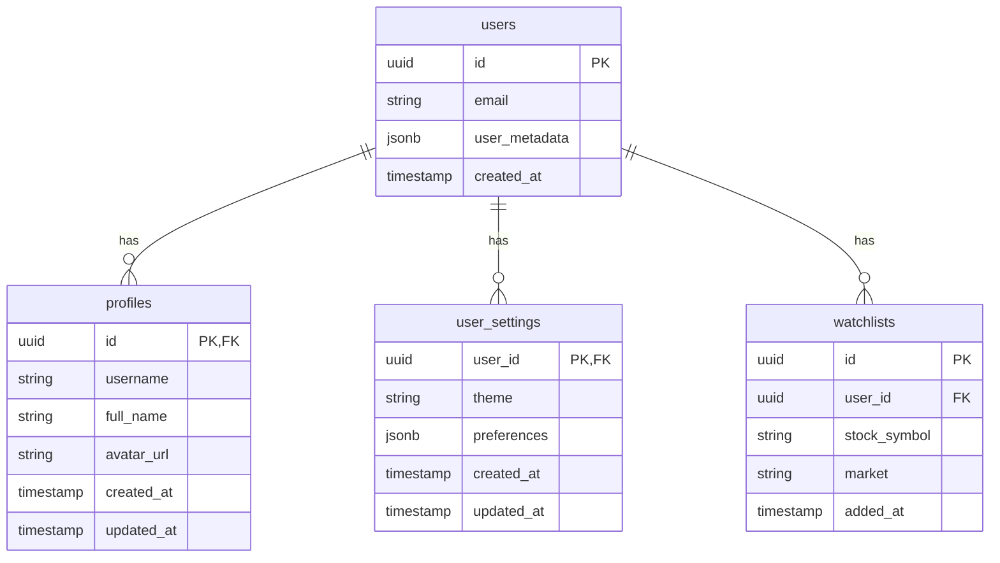
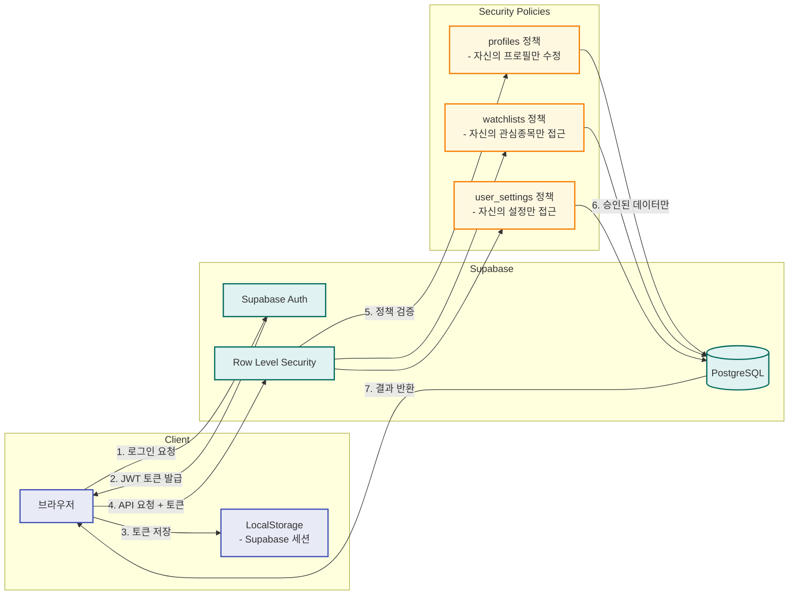
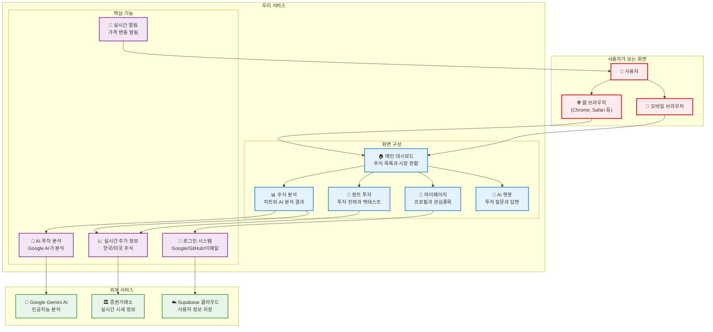
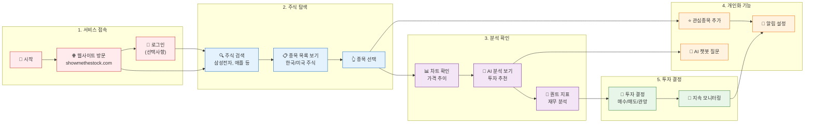
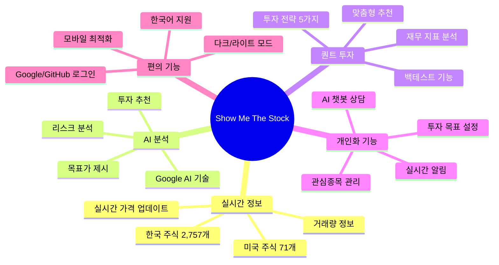
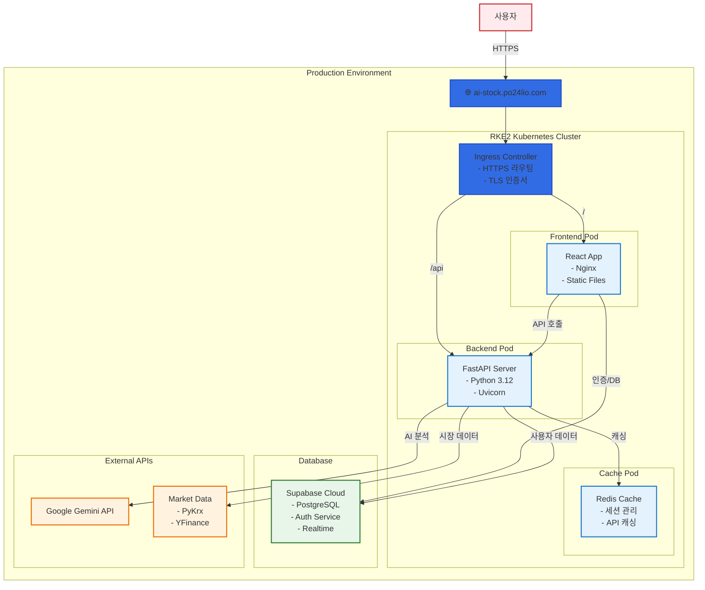

# Show Me The Stock - System Architecture

## 전체 시스템 아키텍처

```mermaid
graph TB
    subgraph "Frontend - React TypeScript"
        subgraph "UI Layer"
            UI[React Components]
            UI --> Views[View Components]
            Views --> Dashboard[Dashboard]
            Views --> StockAnalysis[Stock Analysis]
            Views --> QuantView[Quant Investment]
            Views --> Portfolio[Portfolio]
            Views --> Watchlist[Watchlist]
            Views --> Profile[Profile]
            Views --> News[News]
            Views --> Chat[AI Chat]
        end

        subgraph "State Management"
            Context[React Context]
            Context --> AppContext["AppContext<br/>전역 상태<br/>검색/필터<br/>선택 종목"]
            Context --> AuthContext["AuthContext<br/>사용자 인증<br/>세션 관리<br/>프로필 정보"]
            Context --> ThemeContext["ThemeContext<br/>다크/라이트 모드<br/>UI 테마"]
        end

        subgraph "Services Layer"
            Services[Frontend Services]
            Services --> WatchlistService["WatchlistService<br/>관심종목 CRUD<br/>Supabase 연동"]
            Services --> NotificationService["NotificationService<br/>WebSocket 연결<br/>실시간 알림<br/>알림 설정"]
            Services --> StockService["StockService<br/>API 호출<br/>데이터 캐싱"]
        end

        subgraph "External Integration"
            Supabase[Supabase Client]
            Supabase --> Auth["Authentication<br/>OAuth Google/GitHub<br/>Email/Password<br/>Session 관리"]
            Supabase --> Database["Database<br/>profiles<br/>user_settings<br/>watchlists"]
        end
    end

    subgraph "Backend - FastAPI Python"
        subgraph "API Layer"
            FastAPI[FastAPI Server]
            FastAPI --> Endpoints[API Endpoints]
            Endpoints --> StocksAPI["Stocks API<br/>종목 목록<br/>상세 정보<br/>가격 데이터"]
            Endpoints --> QuantAPI["Quant API<br/>퀀트 지표<br/>백테스트<br/>전략 추천"]
            Endpoints --> AIAPI["AI API<br/>AI 분석<br/>투자 추천"]
            Endpoints --> RealtimeAPI["Realtime API<br/>WebSocket<br/>실시간 알림"]
            Endpoints --> NewsAPI["News API<br/>뉴스 검색<br/>감성 분석"]
        end

        subgraph "Business Logic"
            Services2[Backend Services]
            Services2 --> AIService["AI Analysis Service<br/>Gemini API 연동<br/>분석 로직<br/>추천 생성"]
            Services2 --> QuantService["Quant Service<br/>지표 계산<br/>백테스트 엔진<br/>전략 평가"]
            Services2 --> RealtimeService["Realtime Service<br/>가격 모니터링<br/>알림 생성<br/>WebSocket 관리"]
            Services2 --> FinancialDataService["Financial Data Service<br/>재무 데이터 수집<br/>지표 계산"]
        end

        subgraph "Data Providers"
            DataLayer[Data Providers]
            DataLayer --> PyKrx["PyKrx Provider<br/>한국 주식<br/>실시간 가격<br/>재무 데이터"]
            DataLayer --> YFinance["YFinance Provider<br/>미국 주식<br/>글로벌 데이터<br/>히스토리 데이터"]
            DataLayer --> NewsProvider["News Provider<br/>Google Search<br/>뉴스 수집"]
        end

        subgraph "Infrastructure"
            Cache["Redis Cache<br/>가격 캐싱<br/>세션 관리"]
            WSManager["WebSocket Manager<br/>연결 관리<br/>구독 관리"]
        end
    end

    subgraph "External Services"
        GeminiAI["Google Gemini API<br/>AI 분석<br/>자연어 처리"]
        SupabaseDB[("Supabase Database<br/>PostgreSQL<br/>Row Level Security<br/>Realtime 구독")]
    end

    %% Connections
    UI --> Context
    Views --> Services
    Services --> FastAPI
    Auth --> SupabaseDB
    Database --> SupabaseDB
    
    StocksAPI --> Services2
    QuantAPI --> QuantService
    AIAPI --> AIService
    RealtimeAPI --> RealtimeService
    NewsAPI --> Services2
    
    AIService --> GeminiAI
    Services2 --> DataLayer
    RealtimeService --> WSManager
    Services2 --> Cache
    
    NotificationService -.->|WebSocket| RealtimeAPI
    WatchlistService --> Database

    classDef frontend fill:#e1f5fe,stroke:#01579b,stroke-width:2px
    classDef backend fill:#fff3e0,stroke:#e65100,stroke-width:2px
    classDef external fill:#f3e5f5,stroke:#4a148c,stroke-width:2px
    classDef data fill:#e8f5e9,stroke:#1b5e20,stroke-width:2px
    
    class UI,Views,Context,Services,Supabase,Dashboard,StockAnalysis,QuantView,Portfolio,Watchlist,Profile,News,Chat,AppContext,AuthContext,ThemeContext,WatchlistService,NotificationService,StockService,Auth,Database frontend
    class FastAPI,Endpoints,Services2,DataLayer,Cache,WSManager,StocksAPI,QuantAPI,AIAPI,RealtimeAPI,NewsAPI,AIService,QuantService,RealtimeService,FinancialDataService backend
    class GeminiAI,SupabaseDB external
    class PyKrx,YFinance,NewsProvider data
```

## 데이터 흐름도

## 컴포넌트 계층 구조

## 데이터베이스 스키마

## 보안 및 인증 흐름

## 비개발자를 위한 시스템 구성도

### 서비스 전체 구조

### 사용자 여정 (User Journey)

### 주요 기능 설명

## 배포 아키텍처

